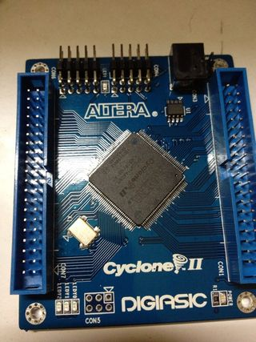
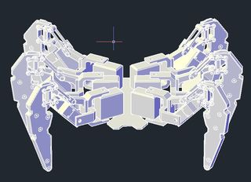
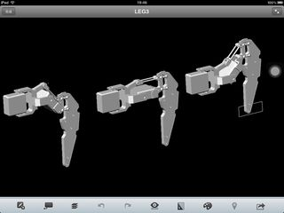
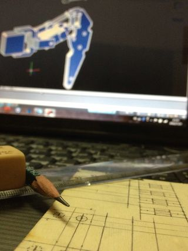
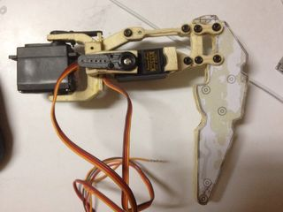
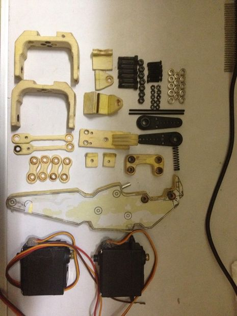
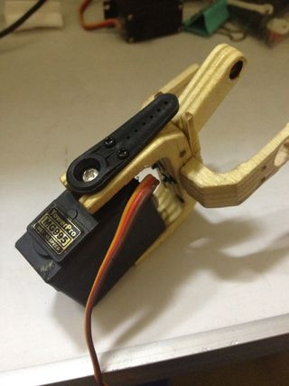

#基于FPGA的六脚机器人

这是一个由12个直流伺服电机组成的六脚机器人，由一个FPGA芯片控制。这个架构是可编程和可扩展的。我们可以设计不同的程序来控制机器人。
我的灵感来自Kondo KMR-M6机器人。（Kondo是一家制造机器人模型的日本公司）我很喜欢这些现代玩具，但是太贵了，买不起，所以就想自己造一个。
思路是先用胶合板雕刻单条腿，这需要很长时间，然后试着用PU胶复制得到六条腿。
现在就开始吧！
#第一步：你可能需要准备以下装备

##设备：
锯、电动磨床、电钻、铅笔、螺丝刀、卡钳
##材料：
胶合板、PU树脂、硅胶、螺丝、螺母、滚珠轴承
##其他：
伺服电机、CAD和EDA软件、FPGA最小系统板（我用的是Altera CycloneII）
#第二步：3D模型和2D蓝图

由于模型精度要求，我们需要用CAD工具（如：AUTODESK AUTOCAD软件）为六脚机器人创建一个3D模型，以便您可以很容易地调整机器人的尺寸和形状。
神马？你之前从来没接触过AutoCAD？好吧，我也是^_^。不过我用了一个星期边学边绘制这个模型。这类软件学习的一个比较好的方式就是需要啥学啥。
每一个腿有两个旋转自由度，一个水平旋转、一个垂直旋转。垂直运动机构是平行四边形结构，可以容易地旋转并保持爪直立。我们可以通过一些仿真工具来模拟移动，比如移动设备上的Autodesk ForceEffect。
#第三步：制作原型部分

我想说手工制作这些腿真的很累，要是我有3D打印机就好了，不会遭罪了，这也是我为毛要先做一个3D模型的原因。
这部分我就不多说了，因为这就是一个原型，我们只需要制作这个形状就可以。用你的电锯、电动磨床、电钻、铅笔、螺丝刀、卡钳等等你能用的。
关键点在于根据你选择的螺丝钻一个非常精确的孔，以便于每一个部件都可以安装到一起。
#第四步：机电调试

在这一步中，我们必须确保原型腿可以正常移动。还要确保伺服电机可以通过FPGA芯片正确驱动。
我们来看一下直流伺服电机，它是由电动马达、驱动齿轮、减速齿轮组、大力矩组件、反馈元件和定位保持齿轮组成。引出来3条输入线：电源、地和控制线。供电电源5-8V，控制信号接FPGA的GPIO端口，这是一个PWM信号用以驱动电机齿轮到一个确定位置。
通过Verilog编写一些简单的模块就可以实现你能够想象的大多数功能。我这里用的是Altera CycloneII FPGA芯片和QuartusII综合工具，还是因为它够便宜、容易买得到。
神马？你之前从来没有接触过Verilog和Quartus?没关系，我也是。。。现学现用咯。
后面就是要保证原型腿工作正常，我们就可以进行下一步了。
#第五步：用PU胶复制原型

要是你有3D打印机，这一步略过。我们将复制几个原型腿。
首先，将硅胶或者和它类似的材料与凝结剂混合，然后将混合物挖去一部分，就得到了一个模具。在挖的时候小心点，因为接下来我们要倒液体到模具中。
搞定所以模具之后，我们就需要PU胶了。PU胶分为A、B两瓶，按1：1混合就可以。您可能需要多次尝试，在混合的时候您注意安全，这个胶会放出大量的热量。
做一些抛光和雕刻处理，所有的零件都齐活了。
#第六步：安装和接线

我在第一张图片里列出了一条腿所需要的所有组件，包括7个M3螺丝和螺母，10个M2螺丝和螺母，14个M3球轴承，2个直流伺服电机以及我们在前面的步骤中制造的其他部件。
为了方便起见，我以这里的原型为例。我拍摄了每个步骤。逐步安装每条腿的所有组件，然后将它们固定在机箱上。
我们一共有12个电机和36个线。在支架周围和底部布线。电源线和地线插入电源板引脚。信号线接到FPGA板的GPIO上，这些引脚通过Quartus来分配。然后放一个包含8个1.5V的电池包，其中4个串联然后两组并联。其中6V给机器人供电。通过开发板上的线性电源，将5V转成3.3V、2.5V或者1.2V给芯片供电。
机器人的顶部是一个红外传感器。第一代机器人，我暂时用红外传感器来接收遥控器信号，这个遵循通用的红外传输协议，比如NEC协议。
#第七步：延伸

最后，我们已经完成这个创意的绝大部分工作。确实需要您的坚持不懈。现在这就是一个可编程的机电机器人了。它怎么运动和反应完全由您的程序来控制，这也是我当初选FPGA平台的原因，对于设计和调试都很便捷。
在调试过程中，有许多问题需要解决，比如由于机械腿的惯性作用会引起电机的抖动。
这个机器人有什么用？我也不太确定。但至少它是一个玩具，其次也是对FPGA可编程期间的一次学习。
最后但并非不重要，您可以根据需要扩展其功能。比如，我在第一代使用了红外传感器，但我们可以通过WIFI模块或者WIFI通信协议或者写一个IOS的APP，通过您的苹果来操控它。此外，我们可以在它前额搭载一个摄像头，这样它就可以传输图像和视频或者嵌入一个图像处理模块用于搜索某个目标。
最后十分感谢您的阅读，这是我的第一次写作，很高兴能够得到您的反馈。如果您有任何建议或问题，给我留言吧。再次声明，该机器人是受到ASIC平台Kondo KMR-M6机器人的启发，本文仅供参考，无商业目的。

      
     
    

    

    

